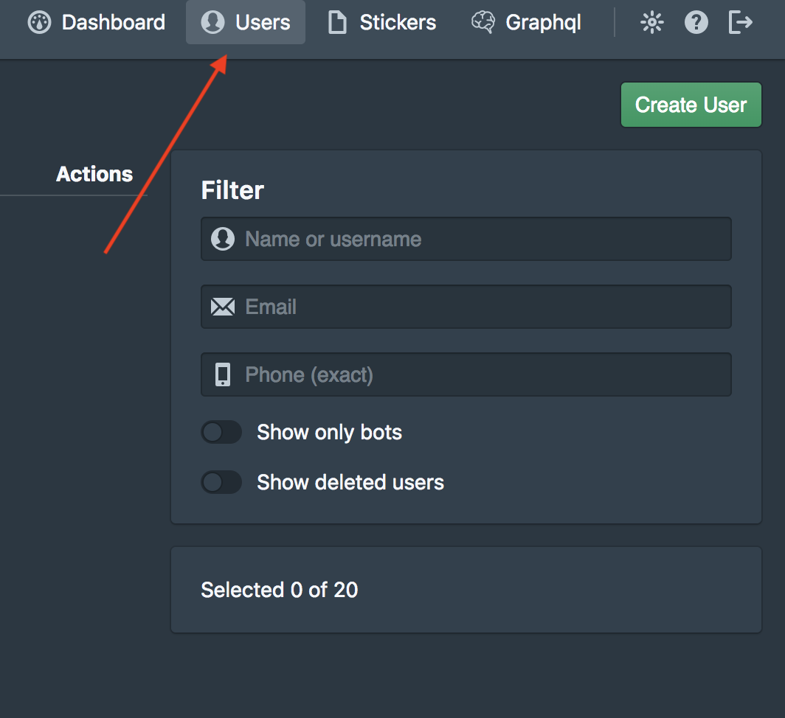
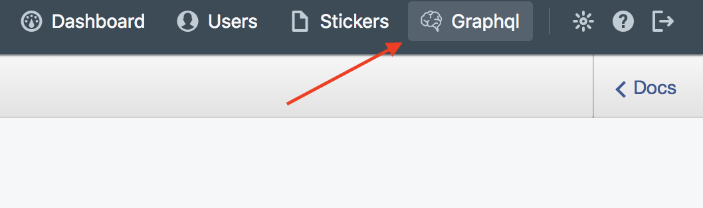
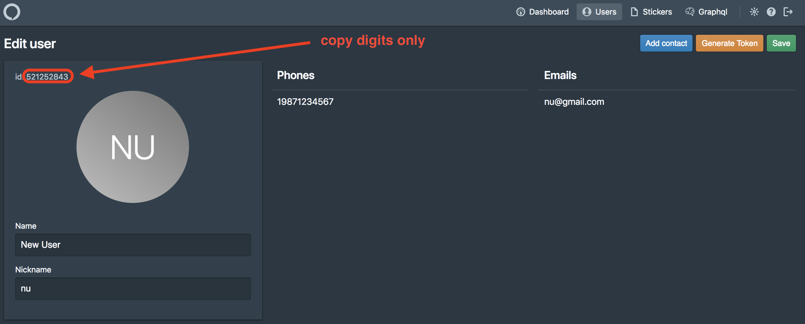

# Dialog EE Server

[Dialog](https://dlg.im) is a handy and feature-rich enterprise multi-device messenger available for server or cloud – Slack-like, but not Slack-limited

## What is this?
This auto of demo all-in-one installation for testing Dialog EE Server on your server. You may use Amazon AMI to run this demo without install.

* [Manual install](#manual-install)
* [Deploy Amazon AMI](#deploy-amazon-ami-instead-of-manual-installation)

### Prerequisites
* Getting license

Write your request to e-mail - services@dlg.im.
In response you will receive license base64 string.

### Manual install

#### Requirements
* 4 cores CPU / 8 GB RAM
* Debian 8/9
* Git
* Bash

#### Preparations

Write your request to e-mail - services@dlg.im.

In response you will receive dialog-setup.zip file.

##### Quick install

Please find dialog-setup.zip attached file in reply email on your request to services@dlg.im.

It contains:
`prepare.sh` - Shell-script executes initial system prepare and then run main setup programm. 
`license.txt` - Contains your license key in plaintext to use during the prepare.sh script work. 
`ee-registry.json` - The access to our repository that script will use. 

Put dialog-setup.zip on server with clean Debian (8 or 9) install in home directory under the root user (/root/)

To start installation process, copy and execute the following line in the server console under the root user:

```cd ~; apt-get install -y unzip; unzip dialog-setup.zip; bash prepare.sh```

##### Advanced manual installation with options define

##### Variables:
You MUST define main variables to successfully complete setup process.

##### Main Variables
`server_license` - License key for Dialog Server.

`project_name: "My EE"` - External name which will be displayed in the email messages, contact books, etc.

`base_url: "example.com"` - IP or uri. Important variable. This address will be used to generate all endpoints.

##### SMTP (optional)
Is used to send password to the user.

`smtp_host: ""` - The hostname of the mail server (for example 'smtp.example.com'' or '192.168.1.15')

`smtp_port: ""` - The port of the mail server (if unspecified, the port 25 will be used). Typically port 25 or 587 for SMTP and 465 for SMTPS

`smtp_from: ""` - Specifies the "From:" header in notification emails (for example: noreply@yourcompany.com)

`smtp_user: ""` - The username to use to connect to the mail server

`smtp_password: ""` - The password to use to connect to the mail server

`smtp_tls: true/false` - If the SMTP server supports the STARTTLS extension this will be used to encrypt mail with SSL/TLS otherwise plaintext will be used. SMTPS servers always support SSL/TLS


##### Acitve Direcory integration (optional)

`ad_host: ""` - The fully qualified domain name of the active directory server 'ad.example.com

`ad_port: ""` - The LDAP port of the directory server. This is usually 389

`ad_domain: ""` - The domain name used by Windows 'company.com'

`ad_user: ""` - User with read access 'reader'

`ad_password: ""` - User password

`ad_sync: "10s"` - sync interval


##### S3 (optional)
By default, the Dialog Server saves all user files on the same server. The Dialog Server can also store files on local or network (NFS, Gluster, etc) file system. Possible integration with AWS

`aws_endpoint: ""` - An endpoint is a URL that is the entry point for a service 's3.amazonaws.com'

`aws_bucket: ""` - AWS bucket name 'my-bucket'

`aws_access: ""` - Access key

`aws_secret: ""` - Secret key

##### Port bindings
Docker services bind on localhost ports.

localhost:[9090, 9080, 9070] reserverd for Dialog Server
* 9090 - HTTP api
* 9080 - web socket
* 9070 - binary tcp

`web_app_port: 8080` - web client container

`invites_port: 8081` - invite services contanier

`dashboard_port: 8082` - dashboard container

##### Wide binds
Binds on 0.0.0.0

80, 443 - NGINX web static files.

`ws_port: 8443` - NGINX there. Port used by clients (Web app, Desktop) for connect to Dialog Server

`tcp_port: 7443` - HAProxy. Here endpoint for mobile clients (Android, iOS)

##### SSL
STRONG RECOMENTED use it

`use_tls: true` - Globaly on/off TLS

`use_letsencrypt: true` - If `use_tls` is true will be get Let’s Encrypt certificate for domain name defined in `base_url`.

`letsencrypt_email: email@example.com` - Email address for important account notifications


```

#### Installing
After configuration you can run the script
```bash
$> ./run.sh
```
This script will install the next software:
* Ansible (which will be used to perform the steps)
* Docker
* docker-compose
* NGINX
* HAProxy

and configure it after.


When the server starts will be create the first admin. His password will STDOUT print
```bash
...
[INFO] [main] [akka.remote.Remoting] Remoting started; listening on addresses :[akka.tcp://actor-cli@172.18.0.5:36013]
[INFO] [main] [akka.remote.Remoting] Remoting now listens on addresses: [akka.tcp://actor-cli@172.18.0.5:36013]
[INFO] [actor-cli-akka.actor.default-dispatcher-2] [akka.tcp://actor-cli@172.18.0.5:36013/user/$a] Connected to [akka.tcp://dialog-server@172.18.0.5:2552/system/receptionist]

-> Admin granted. Password: `<password>` <-

[INFO] [actor-cli-akka.remote.default-remote-dispatcher-8] [akka.tcp://actor-cli@172.18.0.5:36013/system/remoting-terminator] Shutting down remote daemon.
[INFO] [actor-cli-akka.remote.default-remote-dispatcher-8] [akka.tcp://actor-cli@172.18.0.5:36013/system/remoting-terminator] Remote daemon shut down; proceeding with flushing remote transports.
...
```
Use this password for login to dashboard `http://<base_url>/dash`

```admin / <password>```

### Add new users
TL;DR

Open http://<base_url>/dash




If you have configured SMTP server then new user will receive e-mail with password. Email address must be in user contacts.

Or you can set passwords to users through GraphQL


```
mutation {
	users_set_password( user_id: ID, password: "password")
}
```
You can find user ID here:



## Connect to Dialog Server
Web app available on `http://<base-url>`

Server address formula for clients:
```
<scheme>://<base_url>:<port>

```
scheme:
1. For web and Desktop clients
  * `ws` - Without TLS
  * `wss` - If TLS enabled `use_tls` option
2. Mobile clients
  * `tcp` - Without TLS
  * `tls` - If TLS enabled

### Connection examples
```yml
base_url: 10.20.30.40
use_tls: false
ws_port: 8443
tcp_port: 7443
```
`ws://10.20.30.40:8443` - Web app / Desktop

`tcp://10.20.30.40:7443` - Mobile

```yml
base_url: example.com
use_tls: true
ws_port: 8443
tcp_port: 7443
```
`wss://example.com:8443` -  Web app / Desktop

`tls://example.com:7443` - Mobile

## Deploy Amazon AMI (instead of manual installation)
You need a S3 bucket ```<bucket name>``` with public read access and CORS rules:
	
```<?xml version="1.0" encoding="UTF-8"?>
<CORSConfiguration xmlns="http://s3.amazonaws.com/doc/2006-03-01/">
<CORSRule>
    <AllowedOrigin>*</AllowedOrigin>
    <AllowedMethod>GET</AllowedMethod>
    <AllowedMethod>PUT</AllowedMethod>
    <AllowedMethod>POST</AllowedMethod>
    <MaxAgeSeconds>3000</MaxAgeSeconds>
    <AllowedHeader>*</AllowedHeader>
</CORSRule>
</CORSConfiguration> 
```

Go to https://console.aws.amazon.com/ec2/v2/home?#Images:visibility=public-images;name=Dialog%20EE%20Server
or find public AMI with name "Dialog EE Server" on your AWS console

1. Make "Launch" of this image, recomended minimum instance "t2.large".
2. Configure Instance Details — Advanced Details — User data (as text):

```
<license key>
<bucket name>
```

3. Create a new security group on step 6 of deploy image (or do it later):

* ```ssh             22   on 0.0.0.0/0, ::/0``` — ssh
* ```http            80   on 0.0.0.0/0, ::/0``` — web without ssl
* ```https           443  on 0.0.0.0/0, ::/0``` — web with ssl
* ```Custom TCP Rule 7443 on 0.0.0.0/0, ::/0``` — Mobile endpoint
* ```Custom TCP Rule 8443 on 0.0.0.0/0, ::/0``` — Web app / Desktop endpoint

4. Select an existing key pair or create a new key pair for SSH user 'admin' with root access and click "Launch instances"
5. Wait some minutes for instance status checks change from "Initializing" to "2/2 checks passed"
6. The newest version of Dialog EE running on "IPv4 Public IP", you can proceed to the next steps.
* home directory of install: `/home/dialog/ee-server/` (you must **create admin password** by run `create-admin.sh` in this directory):

* ` cd /home/dialog/ee-server/`
* `./create-admin.sh admin`
* `-> User admin was created. Do generate admin password? (y/n): y `
* ```-> Admin granted. Password: `<password>` ```
* The password was saved in **admin.txt**

Use this password for login to dashboard `http://<IPv4 Public IP>/dash`

`admin / <password>`

## Known issues
* Not working auto setup invite service
* Not working auto setup voice server in box
