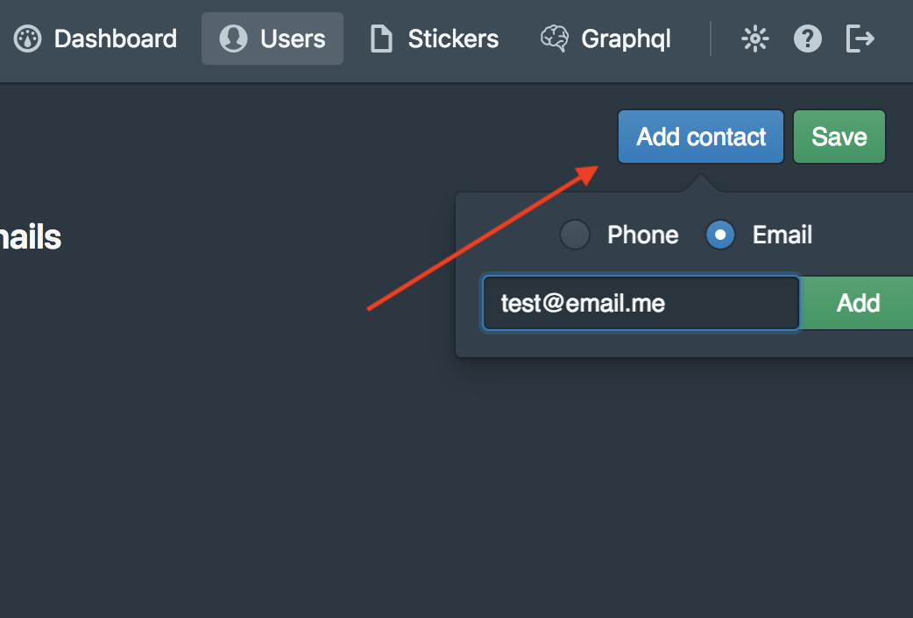

# Dialog EE Server

[Dialog](https://dlg.im) удобный мультиплатформенный мессенджер с богатым функционалом, доступный для установки как на сервер так и в облако, с преимуществами Slack, но без его ограничений.

## Что это?
Инсталятор "все в одном" для проверки Dialog EE Server на Вашем оборудовании. Вы можете использовать Amazon AMI для запуска без установки.

* [Ручная установка](#Ручная-установка)
* [Запуск Amazon AMI](#запуск-в-amazon-ami-вместо-ручной-установки)

### Ручная установка

#### Требования
* 4 ядра CPU / 8 GB ОЗУ
* Debian 8/9
* Git
* Bash

#### Приготовления

Напишите запрос на services@dlg.im.

В ответном письме Вы получите файл dialog-setup.zip.

##### Быстрая установка (рекомендуется)

Полученный архив dialog-setup.zip кладем на сервер с чистой установленной системой Debian (8 или 9) в домашнюю директорию пользователя root.

Для запуска установки, копируем строку приведенную ниже в консоль серевера и выполняем из под пользователя root.

```cd ~; apt-get install -y unzip; unzip dialog-setup.zip; bash prepare.sh```


##### Расширенная установка с определением переменных

##### Переменные:

Обязательные к заполненению поля:

##### Главные переменные
`server_license` - Лицензионный ключ Dialog Server.

`project_name: "My EE"` - Внешнее имя, которое будет отображаться в письмах, контактах и т.п.

`base_url: "example.com"` - IP или домен. Этот адрес будет использован для генерации эндпоинтов.

##### SMTP (опционально)
Будет использовано для отправки пароля пользователю.

`smtp_host: ""` - доменное имя почтового сервера (пример: 'smtp.example.com'' or '192.168.1.15')

`smtp_port: ""` - порт почтового сервера (если не указан, будет использован 25). Типовые порты: 25 или 587 для SMTP и 465 для SMTPS

`smtp_from: ""` - Определяет поле "от" в загаловке письма (пример: noreply@yourcompany.com)

`smtp_user: ""` - пользователь для подключения к почтовому серверу

`smtp_password: ""` - пароль для подключения к почтовому серверу

`smtp_tls: true/false` - Если SMTP сервер поддерживает STARTTLS расширения, они будут использованы для шифрования почты с использованием SSL/TLS. В противном случае будет использована передача обычным тесктом. SMTPS сервера всегда поддерживают SSL/TLS.


##### Acitve Direcory интеграция (опционально)

`ad_host: ""` - FQDN сервера AD 'ad.example.com'

`ad_port: ""` - LDAP порт сервера AD. Обычно 389.

`ad_domain: ""` - Доменное имя, используемое Windows 'company.com'

`ad_user: ""` - Пользователь с правами на чтение 'reader'

`ad_password: ""` - Пароль пользователя

`ad_sync: "10s"` - интервал синхронизации


##### S3 (опционально)
По умолчанию, Dialog Server сохраняет все пользовательские файлы на том же сервере. Dialog Server так же может хранить файлы на локальной или сетевой файловой системе (NFS, Gluster, т.п.). Возможна интеграция с AWS

`aws_endpoint: ""` - Эндпоинт это URL являющийся входной точкой для сервиса 's3.amazonaws.com'

`aws_bucket: ""` - AWS имя корзины 'my-bucket'

`aws_access: ""` - Ключ доступа

`aws_secret: ""` - Секретный ключ

##### Назначения портов
Сервисы докера назначаются на локальные порты.

localhost:[9090, 9080, 9070] зарезервированы за Dialog Server
* 9090 - HTTP api
* 9080 - web socket
* 9070 - binary tcp

`web_app_port: 8080` - контейнер веб клиента

`invites_port: 8081` - контейнер сервиса приглашений (инвайтов)

`dashboard_port: 8082` - контейнер административной панели

##### Внешние порты
Назначаются на 0.0.0.0

80, 443 - NGINX веб, статичные файлы.

`ws_port: 8443` - NGINX. Порт используется клиентами (веб-приложение, десктоп-приложение) для подключения к Dialog Server

`tcp_port: 7443` - HAProxy. эндпоинт для мобильных устройств (Android, iOS)

##### SSL
Настоятельно рекомендуется к использованию

`use_tls: true` - Глобально вкл/выкл TLS

`use_letsencrypt: true` - Если `use_tls` в значении true, будет полуен Let’s Encrypt на домен, указанный в поле `base_url`.

`letsencrypt_email: email@example.com` - email адрес для важных уведомлений для аккаунта Let’s Encrypt


```

#### Установка
По завершении конфигурации, запустите скрипт
```bash
$> ./run.sh
```
Этот скрипт установит следующее ПО:
* Ansible
* Docker
* docker-compose
* NGINX
* HAProxy

и затем сконфигурирует его.

Когда запустится сервер, будет создан первый пользователь-админ. Его пароль можно будет увидеть на стандартном выводе.
```bash
...
[INFO] [main] [akka.remote.Remoting] Remoting started; listening on addresses :[akka.tcp://actor-cli@172.18.0.5:36013]
[INFO] [main] [akka.remote.Remoting] Remoting now listens on addresses: [akka.tcp://actor-cli@172.18.0.5:36013]
[INFO] [actor-cli-akka.actor.default-dispatcher-2] [akka.tcp://actor-cli@172.18.0.5:36013/user/$a] Connected to [akka.tcp://dialog-server@172.18.0.5:2552/system/receptionist]

-> Admin granted. Password: `<password>` <-

[INFO] [actor-cli-akka.remote.default-remote-dispatcher-8] [akka.tcp://actor-cli@172.18.0.5:36013/system/remoting-terminator] Shutting down remote daemon.
[INFO] [actor-cli-akka.remote.default-remote-dispatcher-8] [akka.tcp://actor-cli@172.18.0.5:36013/system/remoting-terminator] Remote daemon shut down; proceeding with flushing remote transports.
...
```
Используйте этот логин и пароль для входа в административную панель `http://<base_url>/dash`
```admin / <password>```

### Добавление нового пользователя

Откройте панель http://<base_url>/dash




Если сконфигурирован SMTP сервер, новый пользователь получит письмо с паролем. Для этого в контактах заводимого пользователя должен быть указан email.

либо Вы можете задать пароль пользователя через GraphQL


```
mutation {
	users_set_password( user_id: ID, password: "password")
}
```
Найти user ID можно сдесь:


## Подключение к Dialog Server
Веб приложение доступно по ссылке `http://<base-url>`

Формула адреса сервера для клиентов:
```
<scheme>://<base_url>:<port>

```
scheme:
1. Для web и Desktop клиентов
  * `ws` - без TLS
  * `wss` - Если TLS включен - `use_tls` опция
2. Мобильные клиенты
  * `tcp` - Без TLS
  * `tls` - Если TLS включен

### Примеры подключения
```yml
base_url: 10.20.30.40
use_tls: false
ws_port: 8443
tcp_port: 7443
```
`ws://10.20.30.40:8443` - Web приложение / Desktop

`tcp://10.20.30.40:7443` - Для мобильных

```yml
base_url: example.com
use_tls: true
ws_port: 8443
tcp_port: 7443
```
`wss://example.com:8443` -  Web приложение / Desktop

`tls://example.com:7443` - Для мобильных

## Установка на Amazon AMI (вместо ручной установки)
Вам понадобится S3 корзина ```<bucket name>``` с публичным доступом на чтение и правилами CORS:
	
```<?xml version="1.0" encoding="UTF-8"?>
<CORSConfiguration xmlns="http://s3.amazonaws.com/doc/2006-03-01/">
<CORSRule>
    <AllowedOrigin>*</AllowedOrigin>
    <AllowedMethod>GET</AllowedMethod>
    <AllowedMethod>PUT</AllowedMethod>
    <AllowedMethod>POST</AllowedMethod>
    <MaxAgeSeconds>3000</MaxAgeSeconds>
    <AllowedHeader>*</AllowedHeader>
</CORSRule>
</CORSConfiguration> 
```

Перейдите по ссылке https://console.aws.amazon.com/ec2/v2/home?#Images:visibility=public-images;name=Dialog%20EE%20Server
или найдите публичный AMI с именем "Dialog EE Server" в Вашей консоли AWS

1. Сделайте "Запуск" этого образа, минимально рекомендуемый тип "t2.large".
2. Configure Instance Details — Advanced Details — User data (as text):

```
<лицензионный-ключ>
<имя-корзины>
```

3. Создайте новую группу безопасности (или сделайте это позже):

* ```ssh             22   on 0.0.0.0/0, ::/0``` — ssh
* ```http            80   on 0.0.0.0/0, ::/0``` — web without ssl
* ```https           443  on 0.0.0.0/0, ::/0``` — web with ssl
* ```Custom TCP Rule 7443 on 0.0.0.0/0, ::/0``` — Mobile endpoint
* ```Custom TCP Rule 8443 on 0.0.0.0/0, ::/0``` — Web app / Desktop endpoint

4. Выберете существующую пару ключей или создайте новую для SSH пользователя 'admin' с root доступом и нажмите "Launch instances"
5. Подождите пока статус проверки инстанса изменится "Initializing" на "2/2 checks passed"
6. Свежая версия Dialog EE запущена на "IPv4 Public IP", можно приступать к следующему шагу.
* домашняя директория установки: `/home/dialog/ee-server/` (Вы должны **создать admin пароль** посредством запуска `create-admin.sh` в этой директории):

* ` cd /home/dialog/ee-server/`
* `./create-admin.sh admin`
* `-> User admin was created. Do generate admin password? (y/n): y `
* ```-> Admin granted. Password: `<password>` ```
* The password was saved in **admin.txt**

Используйте этот пароль для входа в панель `http://<IPv4 Public IP>/dash`

`admin / <password>`

## Известные проблемы
* Не работает автонастройка сервиса инвайтов (приглашений)
* Не работает автонастройка голосового сервера